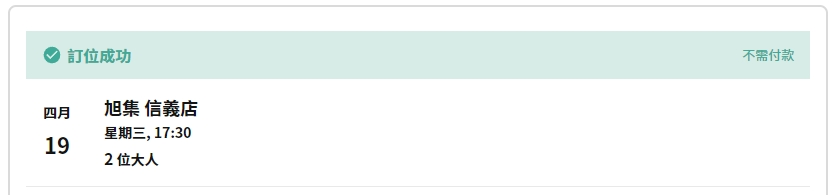

# Feastogether

### 介绍 ✨

歡迎來到 feastogether，此作品提供饗賓餐旅線上快速訂位，不需手動刷新網頁即可預訂你所需的位置，幫助那些想搶位卻總是被擋在門外的人，也抵制那些非法販賣訂位的黃牛。

### 訂位紀錄 ✨




### 開始 ✨

1. Clone 此專案

```bash
git clone https://github.com/zhong1016/feastogether.git
cd ./feastogether
```

2. 修改 `config.ini` 相關資料

請先在 [饗賓餐旅訂位系統](https://www.feastogether.com.tw/) 取得您的用戶帳號與密碼

```ini

[user]
account = <你的用戶帳號>
password = <你的用戶密碼>
ga = <你的 GA cookie>
ga_9PQXQP3QD6 = <你的 GA_9PQXQP3QD6 cookie>

[restaurant]
storeID = <餐廳 ID>
peopleCount = <用餐人數>
mealPeriod = <用餐時段：lunch、tea、dinner>
mealDate = <用餐日期：yyyy-mm-dd>
mealTime = <用餐時間：11:30、12:00、14:30、17:30、18:00、18:30>
```

3. 執行程式

Docker

```bash
docker build -t feastogether .
docker run -it -p 8080:8080 feastogether
```

Docker-compose

```bash
docker-compose up
```

Local

```bash
go mod download
go run main.go
```

4. 輸入驗證

請先在瀏覽器訪問 `http://localhost:8080`，然後輸入圖片上的驗證碼後按下訂位

### 目錄結構 ✨

```text
- client        # booking 程式
- config        # 讀取 ini
- fetch         # 封裝 Http request
- main.go       # 專案入口
- config.ini    # 用戶與餐廳資料
- README.md     # 專案說明文檔
- go.mod        # module 與 依賴
- go.sum        # 檢查依賴版本
```

### 免責聲明 ✨

本訂位程式僅供學術和研究目的使用，開發者不對其准確性、可靠性、完整性、合法性以及使用者使用本程式產生的任何後果承擔責任。<br/>
請勿將本程式用於非法用途或從事任何違法活動( EX : 蝦皮販賣定位轉讓 )，任何因使用本程式而從事違法活動所導致的法律責任由使用者自行承擔，開發者概不負責。

### 授權 ✨

[MIT](./LICENSE)

如果此作品對你有幫助，請考慮給我一顆星星！您的支持將激勵我更加努力 ：）
