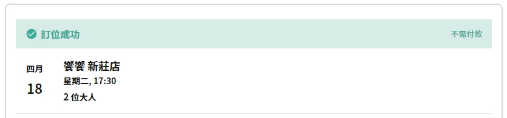
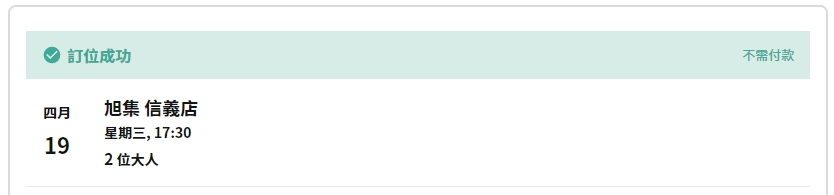

# Feastogether

### 介紹 ✨

歡迎來到 feastogether，此作品提供饗賓餐旅線上快速訂位，不需手動刷新網頁即可預訂你所需的位置，幫助那些想搶位卻總是被擋在門外的人，也抵制那些非法販賣訂位的黃牛。

> 提供 **Go (Gin)** 與 **Java (Spring Boot 3.5)** 兩種版本，功能相同，可依環境選擇使用。

### 訂位紀錄 ✨




---

### 開始 ✨

#### 1. Clone 此專案

```bash
git clone https://github.com/zhong1016/feastogether.git
cd ./feastogether
```

#### 2. 修改設定檔

請先在 [饗賓餐旅訂位系統](https://www.feastogether.com.tw/) 取得您的用戶帳號與密碼。

<details>
<summary><b>Go 版 — 修改 <code>config.ini</code></b></summary>

```ini
[user]
account = <你的用戶帳號>
password = <你的用戶密碼>
ga = <你的 GA cookie>
ga_9PQXQP3QD6 = <你的 GA_9PQXQP3QD6 cookie>

[restaurant]
storeID = <餐廳 ID>
peopleCount = <用餐人數>
mealPeriod = <用餐時段：lunch、tea、dinner>
mealDate = <用餐日期：yyyy-mm-dd>
mealTime = <用餐時間：11:30、12:00、14:30、17:30、18:00、18:30>
```

</details>

<details>
<summary><b>Spring Boot 版 — 修改 <code>src/main/resources/application.yml</code></b></summary>

```yaml
feastogether:
  user:
    account: "<你的用戶帳號>"
    password: "<你的用戶密碼>"
    ga: "<你的 GA cookie>"
    ga-9pqxqp3qd6: "<你的 GA_9PQXQP3QD6 cookie>"
  restaurant:
    store-id: "<餐廳 ID>"
    people-count: 2
    meal-period: lunch          # lunch / tea / dinner
    meal-date: "2025-01-01"     # yyyy-mm-dd
    meal-time: "11:30"          # 11:30 / 12:00 / 14:30 / 17:30 / 18:00 / 18:30
  # 以下為官方 API 硬編碼參數，若官方更換需手動更新
  params:
    zked: "1j6ul4y94ejru6xk7vu4vu4"
    yuuu: "892389djdj883831445"
    store-code: "NTBQ"
    brand-id: "BR00008"
```

</details>

#### 3. 執行程式

**Go 版**

```bash
# Local
go mod download
go run main.go

# Docker
docker build -t feastogether .
docker run -it -p 8080:8080 feastogether

# Docker Compose
docker-compose up
```

**Spring Boot 版**

```bash
# Local（免安裝 Maven，使用內建 Maven Wrapper）
.\mvnw.cmd spring-boot:run          # Windows
./mvnw spring-boot:run              # macOS / Linux

# Docker
docker build -f Dockerfile.spring -t feastogether-spring .
docker run -it -p 8080:8080 feastogether-spring
```

#### 4. 輸入驗證

請在瀏覽器訪問 `http://localhost:8080`，然後輸入圖片上的驗證碼後按下訂位。

---

### 餐廳 ID 對照表 ✨

| 品牌 | 分店 | storeID |
|------|------|---------|
| 饗食天堂 | 京站店 | S2212290001 |
| 饗食天堂 | 台中店 | S2212290002 |
| 饗食天堂 | 新竹店 | S2212290006 |
| 饗食天堂 | 中壢店 | S2212290007 |
| 饗食天堂 | 西門店 | S2212290008 |
| 饗食天堂 | 三多店 | S2212290009 |
| 饗食天堂 | 板橋店 | S2212290010 |
| 饗食天堂 | 新光店 | S2212290011 |
| 饗食天堂 | 信義店 | S2212290012 |
| 饗食天堂 | 夢時代 | S2212290062 |
| 旭集 | 信義店 | S2212290042 |
| 旭集 | 義享店 | S2212290047 |
| 旭集 | 新竹店 | S2212290053 |
| 饗饗 | 信義店 | S2212290004 |
| 饗饗 | 新莊店 | S2212290068 |

---

### 目錄結構 ✨

```text
feastogether/
├── main.go                     # Go 版入口
├── config.ini                  # Go 版設定檔
├── client/                     # Go 版訂位核心邏輯
├── config/                     # Go 版 config 讀取
├── fetch/                      # Go 版 HTTP 封裝
├── templates/                  # Go 版前端模板
│
├── src/main/java/com/feastogether/    # Spring Boot 版 Java 原始碼
│   ├── FeastogetherApplication.java   #   應用程式入口
│   ├── config/                        #   設定綁定
│   ├── controller/                    #   路由控制器
│   ├── dto/                           #   資料傳輸物件
│   └── service/                       #   核心 API 呼叫
├── src/main/resources/
│   ├── application.yml                # Spring Boot 版設定檔
│   └── templates/index.html           # Spring Boot 版前端模板
│
├── pom.xml                     # Maven 設定
├── mvnw.cmd                    # Maven Wrapper (Windows)
├── Dockerfile                  # Go 版 Docker
├── Dockerfile.spring           # Spring Boot 版 Docker
├── docker-compose.yml          # Docker Compose
├── go.mod / go.sum             # Go 依賴
└── README.md                   # 本文件
```

---

### 技術棧 ✨

| | Go 版 | Spring Boot 版 |
|---|---|---|
| **語言** | Go 1.19 | Java 17+ |
| **框架** | Gin | Spring Boot 3.5 |
| **HTTP Client** | net/http | RestClient (Spring 6.1+) |
| **設定檔** | viper + ini | @ConfigurationProperties + YAML |
| **模板引擎** | html/template | Thymeleaf |
| **建置工具** | go build | Maven (含 Wrapper) |

---

### 免責聲明 ✨

本訂位程式僅供學術和研究目的使用，開發者不對其准確性、可靠性、完整性、合法性以及使用者使用本程式產生的任何後果承擔責任。<br/>
請勿將本程式用於非法用途或從事任何違法活動（EX：蝦皮販賣定位轉讓），任何因使用本程式而從事違法活動所導致的法律責任由使用者自行承擔，開發者概不負責。

### 授權 ✨

[MIT](./LICENSE)

如果此作品對你有幫助，請考慮給我一顆星星！您的支持將激勵我更加努力 ：）
